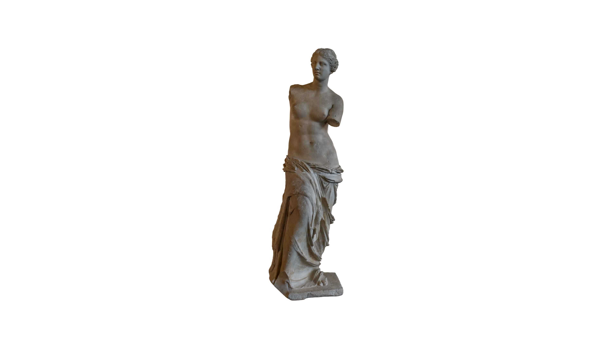
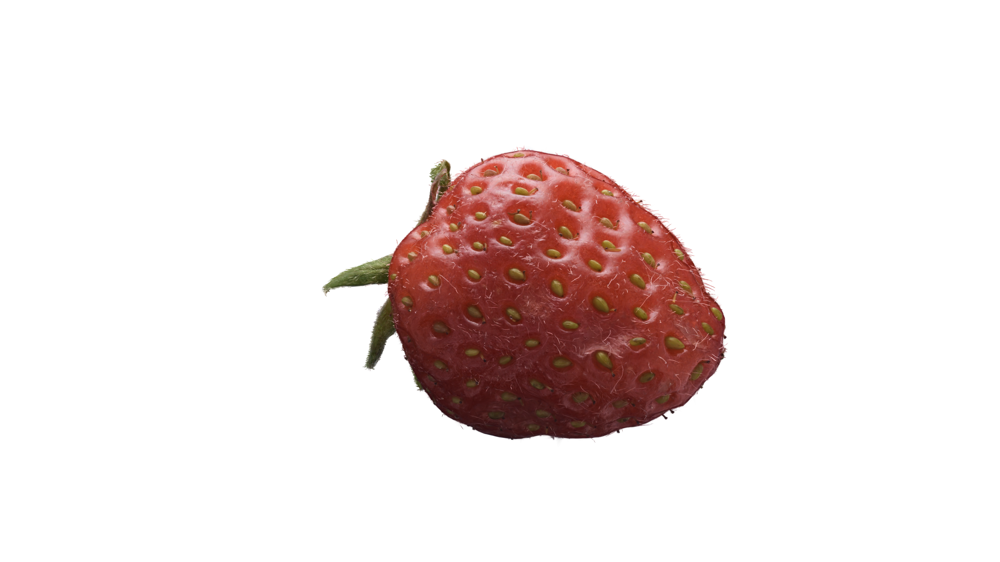
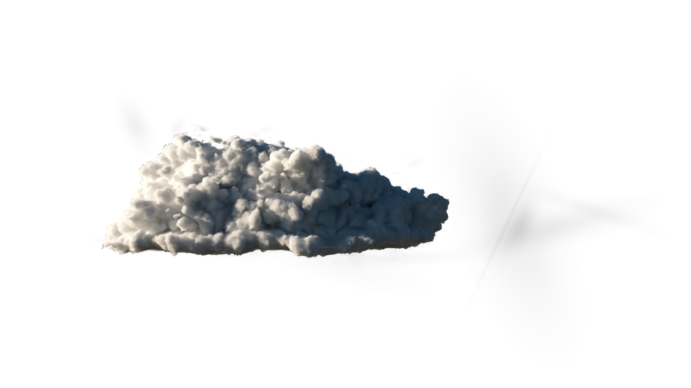

# 3DGS Rendering 101

This project is for educational use and is not meant to be representative of an optimized 3DGS rendering pipeline.

It's a dead simple 2 stage 3DGS rendering pipeline that I can quickly understand, if I ever revisit 3DGS rendering in the future and I have fallen out of familiarity with the topic. 

<br>

## Results generated using this renderer

| Assets  | [Venus de Milo (Louvre Museum)](https://superspl.at/scene/90e88a10) | [Strawberry](https://superspl.at/scene/84df8849) | [Fluffy Cloud](https://superspl.at/scene/c4b482ce) |
| ------- |:-------------------------------------------------------------------:|:------------------------------------------------:|:--------------------------------------------------:|
| Renders |                                 |         |                |

<br>

## Setup 

### Automatic (MacOS and Linux)

```bash
source setup.sh
```
After initial setup, for subsequent usage, activate the python virtual environment with: `source activate_venv.sh`

### Manual (Windows)

```bash
python -m venv .venv
.venv\Scripts\Activate.ps1
python -m pip install --upgrade pip
python -m pip install -r requirements.txt
```

<br>

## Usage

1. Configure the `config.json` file. The default config should work fine if you just want to test something quickly.
    - ⚠️ You can safely ignore all the properties of the camera except the resolution, as most of the properties get overwritten. The entries still need to be present in the config, but the values are not relevant.
    - It's there for future use.
```json
{
    "input_path": "assets/Cloud/scene.ply",
    "output_path": "output/Cloud/render.png",
    "camera": {
        "position": [0.0, 0.0, 0.0],
        "target": [0.0, 0.0, 0.0],
        "up": [0.0, 1.0, 0.0],
        "fov_y": 60.0,
        "near": 0.01,
        "far": 100.0,
        "width": 3840,
        "height": 2160
    }
}
```

2. Run the following.
```bash
python render_all_views.py
```

<br>

## Questions?

### 1. What's the 2 stage pipeline?

1. Sort gaussians based on their depth on the CPU.
2. Instance one user facing quad per gaussian.

### 2. Why python?

Convenience.

### 3. Why sort on the CPU?

Convenience +
Sorting is not the topic of exploration for this project. I am fine treating it as a black box with little regard to performance as when ported to an interactive pipeline, this black box can be trivially switched out for something much more optimal.

### 4. Why OpenGL 4.1? Why not something newer or Vulkan?

1. I have a MacBook Air which does not support newer OpenGL versions.
2. Convenience + I can't be asked to setup all the boiler plate for Vulkan just to instance a few quads. Doing this project in modernGL + python only took a couple of hours and most of the time was spent developing, understanding and debugging the shaders not wrestling with the API.

### 5. Why instance quads, why aren't the gaussians tiled? Isn't that un-optimal?

Well... technically if you ran this on mobile GPUs the hardware would do that for you i.e the quads would get tiled.
But yes, on desktop GPUs this pipeline is far from optimal not just because tilling is not being performed but also because of the programming language of choice, the API of choice, the sorting algorithm of choice, the lack of culling, LODing etc. etc.
Optimization is not the goal here, it's just to understand the math behind rendering a gaussian.
